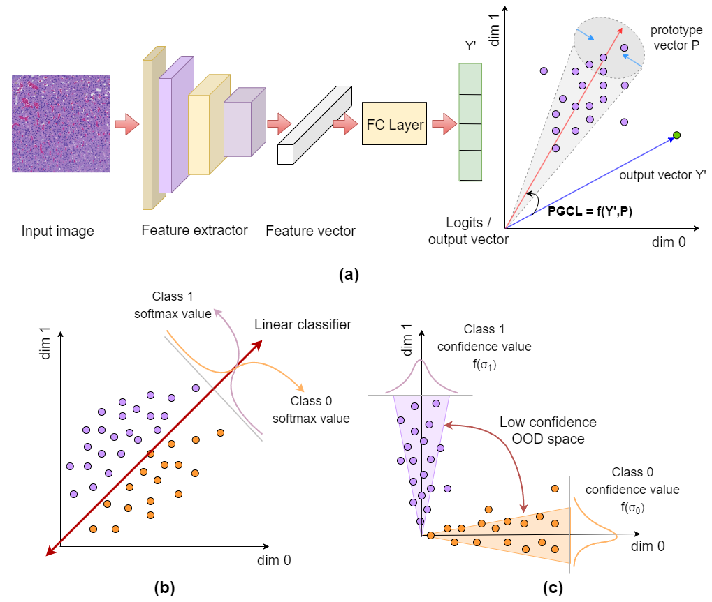

# PGCL
Prototype Governed Contrastive Learning for robust image classification in Histopathology

## PGCL Schematic

Figure(a) shows the schematic of PGCL based training setup.

Figure(b) represents the output feature distribution separated by the trained linear classifier layer. Prediction confidence is computed via Softmax function.

Figure(c) shows the output vectors resulting from PGCL based training. The class vectors distribute in Laplacian distribution around their class prototypes. Prediction confidence is computed using Laplacian distribution mean and standard deviation.

## Visualization of Kather-19 In distribution (ID) and Out-of-distribution (OOD) classes

<!-- ## Results:

### 1. Table showing classification accuracies

| Model Architecture | CE + Argmax | PGCL |
| --- | --- | --- |
| ResNet101(40) | 98.26 ± 0.73 | 98.80 ± 0.48 |
| EffNet B0(2000) | 92.13 ± 0.99 | 93.04 ± 0.66 |
| ViT-S(40) | 99.10 ± 0.07 | 99.20 ± 0.06 |
| Swin-S(40) | 99.40 ± 0.05 | 99.29 ± 0.08 |

### 2. Table showing OOD detection performance

| Command | Description |
| --- | --- |
| git status | List all new or modified files |
| git diff | Show file differences that haven't been staged |

| Model | OOD Set | Out-of-Distribution detection method |
|       |         | Baseline[2] | ODIN[4] | Energy[5] | CE + φc | PGCL + φc |
ResNet101(40)
Adipose 94.56 ± 5.31 90.95 ± 14.24 92.69 ± 11.11 90.67 ± 0.34 98.37 ± 0.44
Debris 93.24 ± 2.50 92.68 ± 3.72 93.66 ± 3.02 85.74 ± 3.83 93.61 ± 0.66
Muscle 95.30 ± 1.68 95.38 ± 2.72 94.25 ± 2.17 91.45 ± 2.58 95.88 ± 0.54
OOD-Stain 92.93 ± 3.66 95.77 ± 2.79 94.55 ± 2.77 83.32 ± 4.01 95.83 ± 1.69
EffNet B0(2000)
Adipose 34.17 ± 3.96 96.82 ± 0.63 30.58 ± 6.89 90.30 ± 0.71 98.53 ± 0.14
Debris 90.10 ± 1.04 91.08 ± 1.27 90.39 ± 0.49 83.91 ± 1.94 87.20 ± 0.65
Muscle 85.76 ± 0.91 77.15 ± 9.35 85.56 ± 0.69 85.04 ± 1.65 89.10 ± 0.46
OOD-Stain 93.44 ± 1.50 96.33 ± 0.98 94.69 ± 0.74 85.36 ± 2.55 92.97 ± 1.22
ViT-S(40)
Adipose 94.98 ± 2.52 96.67 ± 1.80 95.39 ± 3.34 88.49 ± 6.89 97.10 ± 0.75
Debris 93.67 ± 1.15 90.80 ± 3.78 93.67 ± 2.35 89.36 ± 1.58 91.69 ± 2.40
Muscle 96.71 ± 0.41 98.33 ± 0.35 96.94 ± 0.80 91.30 ± 1.25 97.35 ± 0.43
OOD-Stain 81.11 ± 6.78 89.45 ± 5.03 93.92 ± 0.92 74.30 ± 2.42 97.34 ± 0.22
Swin-S(40)
Adipose 97.36 ± 1.89 98.44 ± 1.42 98.03 ± 1.97 87.18 ± 7.21 97.70 ± 0.32
Debris 96.02 ± 0.98 96.87 ± 0.64 95.94 ± 0.59 90.94 ± 1.52 97.23 ± 0.27
Muscle 97.82 ± 0.46 98.55 ± 0.30 95.97 ± 2.34 95.20 ± 0.71 98.14 ± 0.24
OOD-Stain 82.44 ± 3.62 87.28 ± 7.44 95.46 ± 1.38 71.05 ± 4.03 95.76 ± 1.31

 -->
