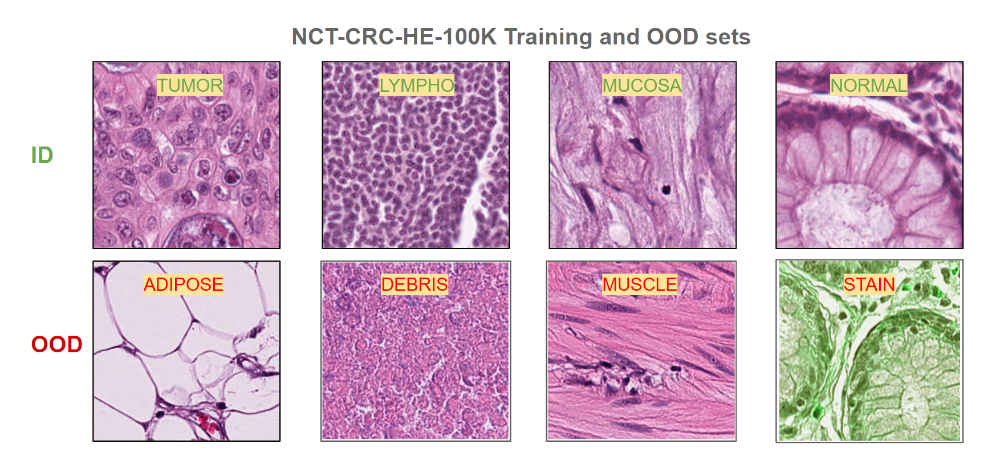

# PGCL
Prototype Governed Contrastive Learning for robust image classification in Histopathology

## PGCL Schematic

## Visualization of Kather-19 In distribution (ID) and Out-of-distribution (OOD) classes

